# Mermaid 圖表範例

本檔案包含架構文件可重複使用的 Mermaid 圖表範本。

## 情境圖 (Context Diagram)

顯示系統邊界與外部參與者/系統。

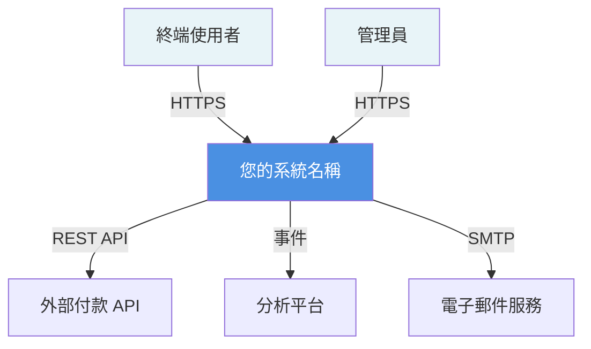

## 容器圖 (Container Diagram) - 微服務

顯示主要應用容器與資料儲存。

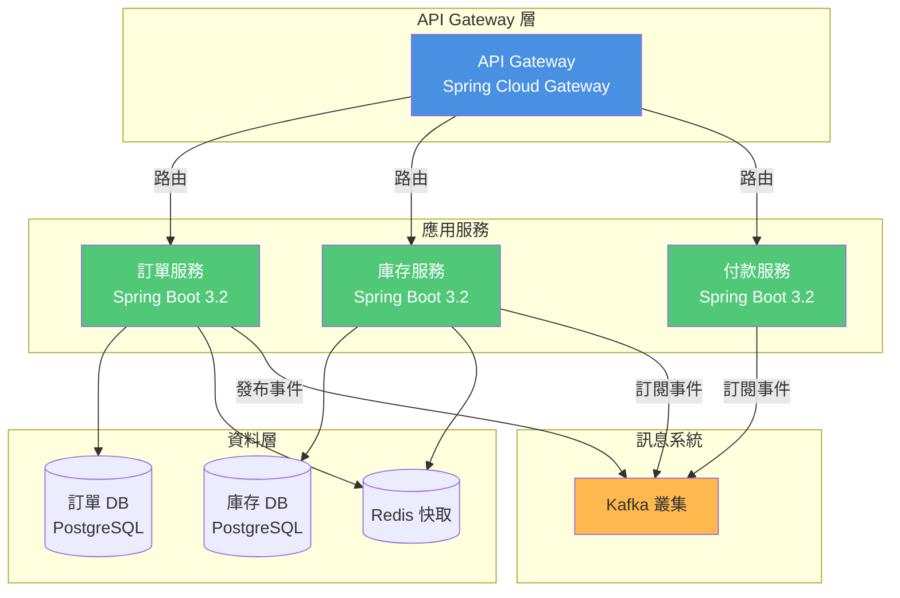

## Bounded Context Map

顯示 DDD Bounded Context 及其關係。

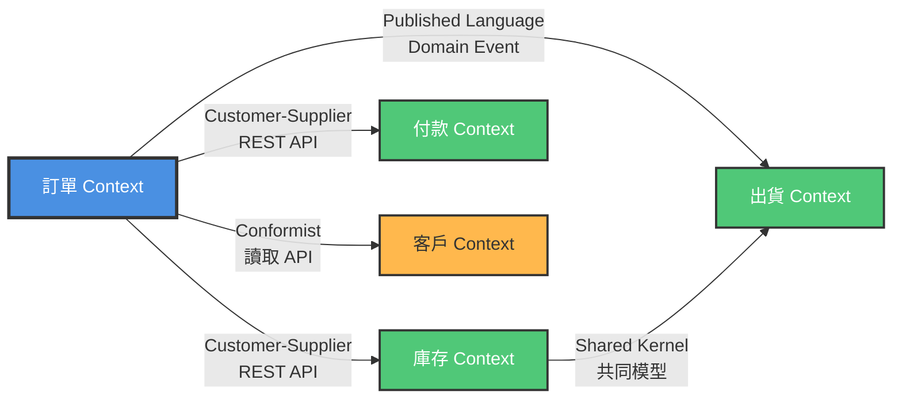

## 元件圖 (Component Diagram) - 服務內部

顯示使用 DDD 層級的服務內部結構。

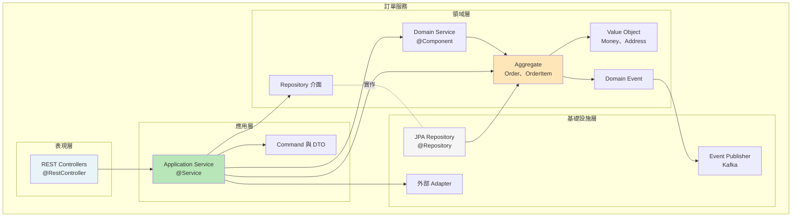

## 循序圖 (Sequence Diagram) - 業務流程

顯示使用案例的元件間互動。

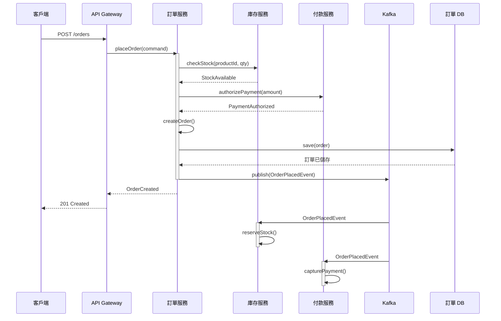

## 部署圖 (Deployment Diagram)

顯示基礎設施與部署拓撲。

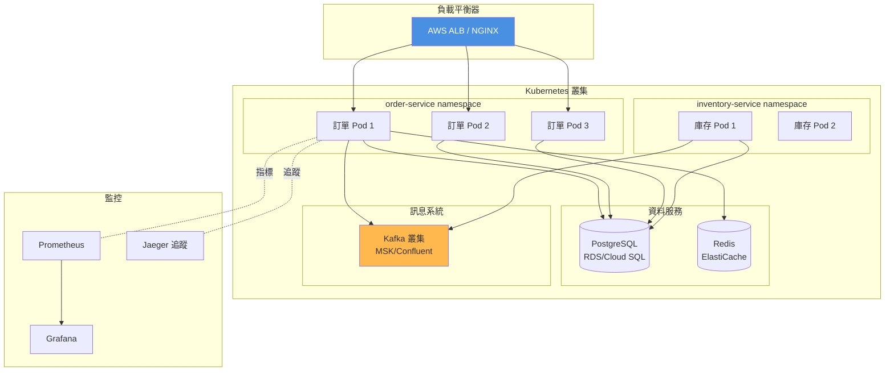

## 實體關係圖 (Entity Relationship Diagram)

顯示資料庫綱要關係。

```mermaid
erDiagram
    ORDERS ||--o{ ORDER_ITEMS : 包含
    ORDERS ||--|| SHIPPING_ADDRESSES : 有
    ORDERS {
        uuid order_id PK
        uuid customer_id
        varchar order_status
        decimal total_amount
        varchar currency
        timestamp placed_at
        bigint version
        timestamp created_at
        timestamp updated_at
    }
    
    ORDER_ITEMS {
        uuid item_id PK
        uuid order_id FK
        uuid product_id
        int quantity
        decimal unit_price
        decimal subtotal
    }
    
    SHIPPING_ADDRESSES {
        uuid order_id PK_FK
        varchar street_line1
        varchar street_line2
        varchar city
        varchar state
        varchar postal_code
        varchar country_code
    }
```

## 狀態圖 (State Diagram) - 訂單狀態

顯示 aggregate 的狀態轉換。

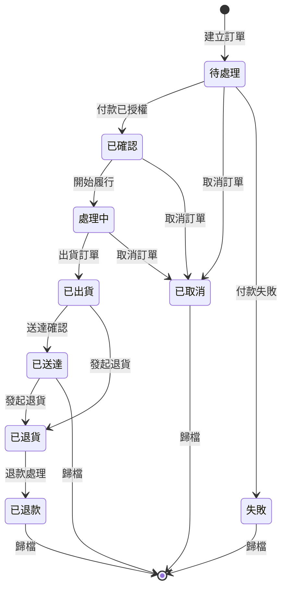

## 資料流程圖 (Data Flow Diagram) - 事件處理

顯示資料如何透過事件流經系統。

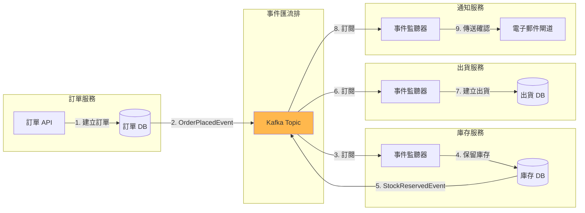

## Saga 模式圖 (分散式交易)

顯示補償交易流程。

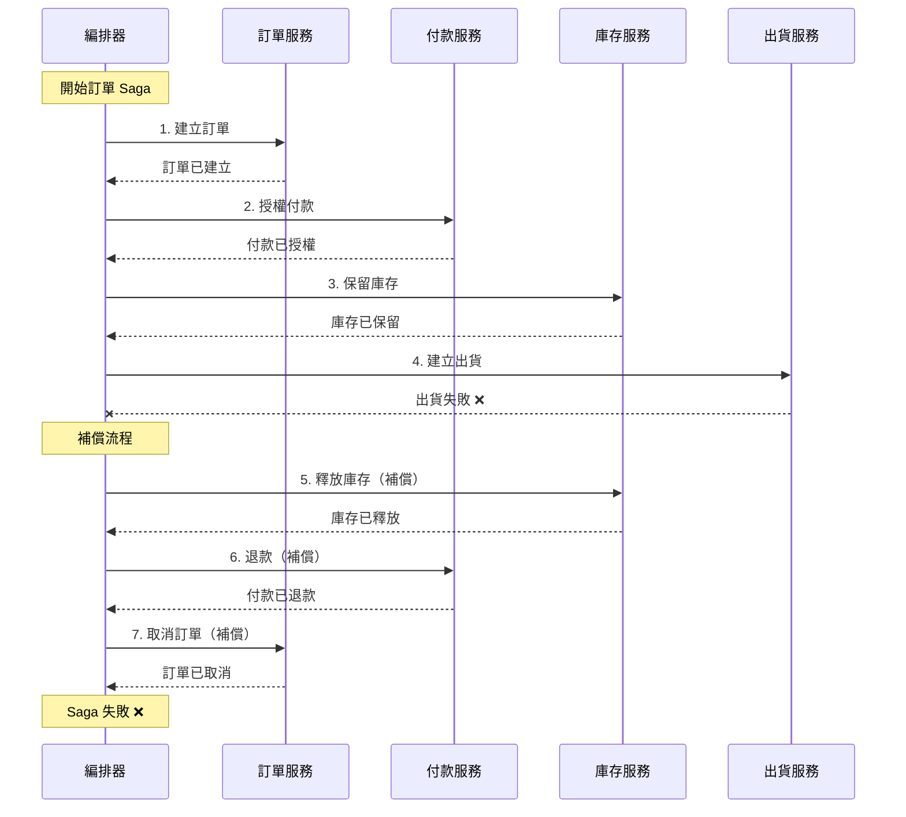

## 架構決策圖

視覺化關鍵決策及其關係。

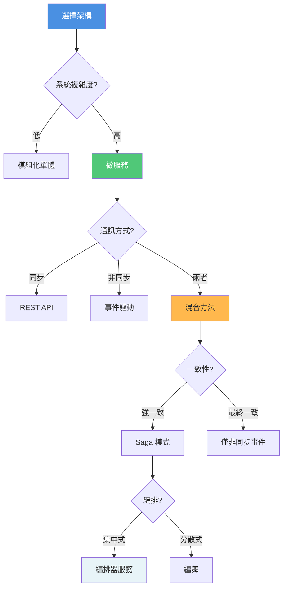

## 類別圖 (Class Diagram) - 領域模型

顯示 DDD 領域模型結構。

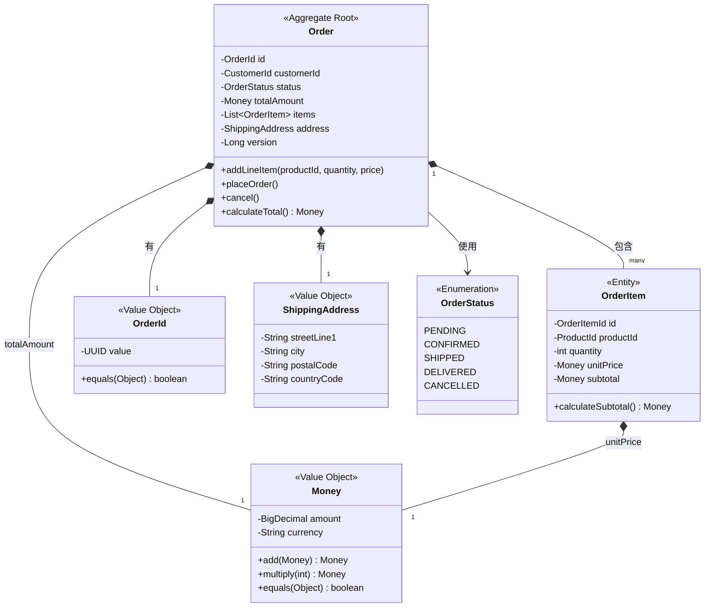
