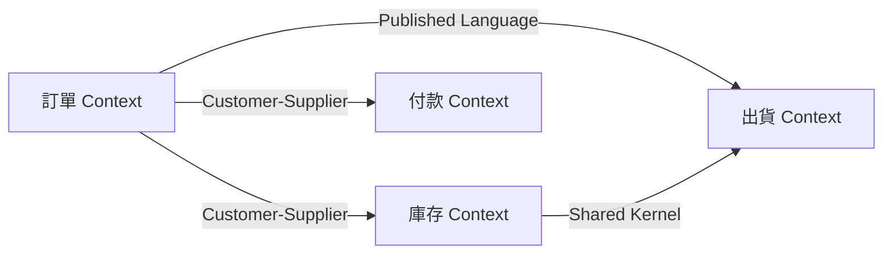
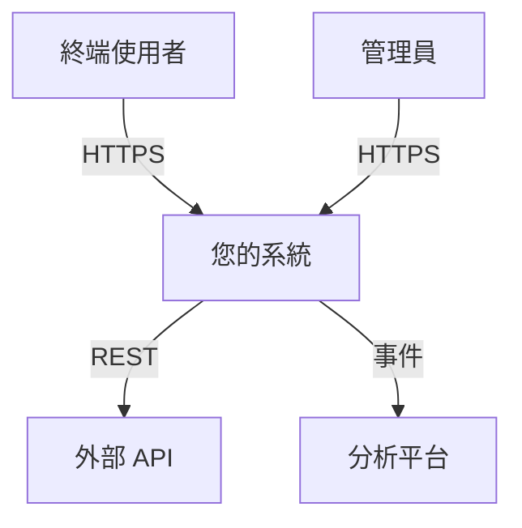
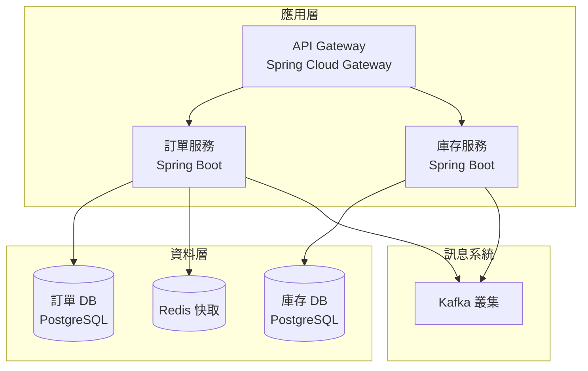

# 架構文件範本

本檔案包含每種架構文件的詳細範本。使用這些作為起點，並根據特定專案進行客製化。

## 01-系統總覽.md 範本

```markdown
---
title: 系統總覽
date: YYYY-MM-DD
---

# 系統總覽

## 執行摘要

系統簡述（2-3 段）：
- 系統功能
- 主要商業價值
- 關鍵利益關係人

## 系統背景

### 業務背景
- 要解決的業務問題
- 目標使用者/利益關係人
- 支援的關鍵業務流程

### 技術背景
- 系統邊界
- 外部系統與相依性
- 整合點

### 範疇

**涵蓋範圍：**
- 包含的功能與能力
- 涵蓋的 Bounded Context
- 技術職責

**不涵蓋範圍：**
- 明確排除的功能
- 延後的能力
- 外部系統職責

## 關鍵指標與成功標準

- 使用者指標（DAU、交易量等）
- 效能目標
- 業務 KPI

## 文件結構

架構文件組織概述及其他文件連結。
```

## 02-架構目標.md 範本

```markdown
---
title: 架構目標與限制條件
date: YYYY-MM-DD
---

# 架構目標與限制條件

## 品質屬性需求

### 效能
- **回應時間**：關鍵操作的目標延遲（如 p95 < 500ms）
- **吞吐量**：每秒請求數、每分鐘訊息數
- **資料量**：預期的資料成長、記錄數

### 可擴展性
- **水平擴展**：增加實例的能力
- **垂直擴展**：每個實例的資源限制
- **地理分布**：多區域需求

### 可用性
- **正常運行時間目標**：99.9%、99.99% 等
- **復原時間目標 (RTO)**：最大停機時間
- **復原點目標 (RPO)**：可接受的資料損失
- **維護視窗**：計劃性停機政策

### 安全性
- **身份驗證**：機制（OAuth、JWT 等）
- **授權**：基於角色、基於屬性
- **資料保護**：靜態與傳輸加密
- **合規性**：GDPR、SOC 2、產業標準

### 可維護性
- **程式碼品質**：標準、審查流程
- **測試覆蓋率**：目標百分比、測試類型
- **部署頻率**：CI/CD 能力
- **文件**：標準與工具

### 可觀測性
- **日誌記錄**：集中式日誌需求
- **監控**：指標、儀表板、告警
- **追蹤**：分散式追蹤能力

## 限制條件

### 技術限制
- 必要的技術（公司標準）
- 禁止的技術
- 平台限制

### 業務限制
- 預算限制
- 上市時間需求
- 資源可用性

### 法規限制
- 法律要求
- 產業法規
- 資料駐留規則

### 組織限制
- 團隊結構與技能
- 需整合的既有系統
- 遷移考量

## 架構決策記錄 (ADR)

### ADR-001：[決策標題]

**背景**：情境與問題陳述

**決策**：做出的決定

**後果**：
- 正面結果
- 負面權衡
- 緩解策略

**考慮的替代方案**：其他選項及為何被拒絕

**狀態**：提議中 | 已接受 | 已棄用 | 已取代

[針對每個重大決策重複]
```

## 03-DDD設計.md 範本

```markdown
---
title: 領域驅動設計
date: YYYY-MM-DD
---

# 領域驅動設計

## Bounded Context

### [Context 名稱] Bounded Context

**目的**：核心職責與業務能力

**通用語言**：
- 關鍵術語及其含義
- 領域特定詞彙
- 重要概念詞彙表

**核心領域元素**：
- Entity：具有識別的關鍵業務物件
- Value Object：不可變的描述性物件
- Aggregate：一致性邊界
- Domain Service：無狀態的領域操作
- Domain Event：重要的業務事件

**職責**：
- 主要使用案例
- 擁有的業務規則
- 管理的資料

**相依性**：
- 上游 context
- 下游 context
- 外部系統

[針對每個 Bounded Context 重複]

## Context Map



### Context 關係

**訂單 ↔ 庫存**：Customer-Supplier
- Order Context 依賴 Inventory 獲取庫存資訊
- Inventory 透過事件提供 Published Language
- Order Context 中的 Anticorruption Layer

**訂單 ↔ 付款**：Customer-Supplier
- Order 發起付款請求
- Payment 發布成功/失敗事件
- Conformist 關係 - Order 適應 Payment 模型

**訂單 → 出貨**：Published Language
- Order 發布 OrderPlaced 事件
- Shipping 訂閱並處理
- Open Host Service 模式

[記錄每個關係]

## Aggregate 設計

### [Aggregate 名稱] Aggregate

**Aggregate Root**：[EntityName]

**不變量**：
1. 必須始終為真的業務規則
2. 一致性需求
3. 驗證限制

**Aggregate 內的 Entity**：
- 子實體
- 它們的關係

**Value Object**：
- 描述性物件
- 不可變屬性

**Domain Event**：
- 此 aggregate 發布的事件
- 事件承載結構

**Repository 介面**：
```java
public interface OrderRepository {
    Order save(Order order);
    Optional<Order> findById(OrderId id);
    List<Order> findByCustomerId(CustomerId customerId);
}
```

**使用範例**：
```java
// 建立新訂單
Order order = Order.create(customerId, shippingAddress);
order.addLineItem(productId, quantity, price);
order.placeOrder();

orderRepository.save(order);
// 發布 OrderPlaced Domain Event
```

## Domain Service

不自然屬於 Entity 或 Value Object 的服務：

### [Service 名稱]

**目的**：執行的協調或計算

**介面**：
```java
public interface PricingService {
    Money calculateOrderTotal(Order order);
    Money applyDiscount(Money basePrice, DiscountCode code);
}
```

**使用**：何時及如何呼叫

## 戰略設計模式

### 模式：Anticorruption Layer
**應用位置**：[Context] 消費 [外部系統]
**實作**：Adapter 類別、轉譯器
**理由**：保護領域模型免受外部變更影響

### 模式：Published Language
**應用位置**：[Context] 發布事件
**共享模型**：事件綱要、API 契約
**版本策略**：如何維護向後相容性

### 模式：Shared Kernel
**應用位置**：[Context A] 與 [Context B]
**共享程式碼**：共同函式庫、模型
**治理**：如何協調變更
```

## 04-系統架構.md 範本

```markdown
---
title: 系統架構視圖
date: YYYY-MM-DD
---

# 系統架構

## 架構視圖

### 情境視圖

展示系統邊界與外部參與者/系統的高階視圖。



**外部相依性**：
- **外部 API**：目的、SLA、備援策略
- **分析平台**：傳送的資料、頻率、保留

### 容器視圖

主要執行時元件與資料儲存。



**容器**：

**API Gateway**：
- 技術：Spring Cloud Gateway
- 職責：路由、限流、身份驗證
- 擴展：負載平衡器後的 3+ 實例

**訂單服務**：
- 技術：Spring Boot 3.2、Java 21
- Bounded Context：訂單管理
- 資料儲存：PostgreSQL (order_db)
- 快取：Redis 用於頻繁存取的資料
- 訊息：發布至 Kafka

[記錄每個容器]

### 元件視圖（每個服務）

各服務的內部結構。

```mermaid
graph TB
    subgraph "訂單服務"
        Controller[REST Controllers<br/>@RestController]
        AppSvc[Application Services<br/>@Service]
        DomainModel[Domain Model<br/>Aggregates、Entities]
        DomainSvc[Domain Services<br/>@Component]
        Repo[Repositories<br/>@Repository]
        Infra[Infrastructure<br/>JPA、Kafka]
        
        Controller --> AppSvc
        AppSvc --> DomainModel
        AppSvc --> DomainSvc
        DomainModel --> DomainSvc
        AppSvc --> Repo
        Repo --> Infra
    end
```

**層級職責**：
- **表現層**：REST controller、DTO、請求/回應處理
- **應用層**：使用案例編排、交易管理
- **領域層**：業務邏輯、aggregate、domain service
- **基礎設施層**：技術實作、外部整合

## 通訊模式

### 同步通訊

**REST API**：
- API 風格：RESTful、OpenAPI 3.0 規格
- 身份驗證：JWT token
- 限流：每個客戶端 1000 req/min
- 逾時：5s 讀取、30s 寫入

**範例**：
```java
@RestController
@RequestMapping("/api/v1/orders")
public class OrderController {
    @PostMapping
    public ResponseEntity<OrderResponse> createOrder(@Valid @RequestBody CreateOrderRequest request) {
        // ...
    }
}
```

### 非同步通訊

**事件驅動**：
- 訊息代理：Apache Kafka
- 事件綱要：JSON，高吞吐量使用 Avro
- 傳遞保證：至少一次
- 排序：aggregate ID 的分區鍵

**Domain Event**：
```java
@DomainEvent
public class OrderPlacedEvent {
    private OrderId orderId;
    private CustomerId customerId;
    private Money totalAmount;
    private Instant placedAt;
}
```

**事件發布**：
```java
@Service
public class OrderApplicationService {
    @Transactional
    public void placeOrder(PlaceOrderCommand command) {
        Order order = //... 建立訂單
        order.place();
        
        orderRepository.save(order);
        eventPublisher.publish(new OrderPlacedEvent(order));
    }
}
```

## 橫切關注點

### API 版本控制
策略：URI 版本控制 (/api/v1/、/api/v2/)
棄用：6 個月通知期

### 錯誤處理
標準：RFC 9457 Problem Details
回應格式：包含 type、title、status、detail、instance 的 JSON

### 快取策略
- L1：應用層級（Caffeine）
- L2：分散式（Redis）
- TTL：根據資料變動性（1分鐘 - 1小時）
- 快取失效：事件驅動
```

由於文件很長，讓我繼續創建剩餘的範本文件...

