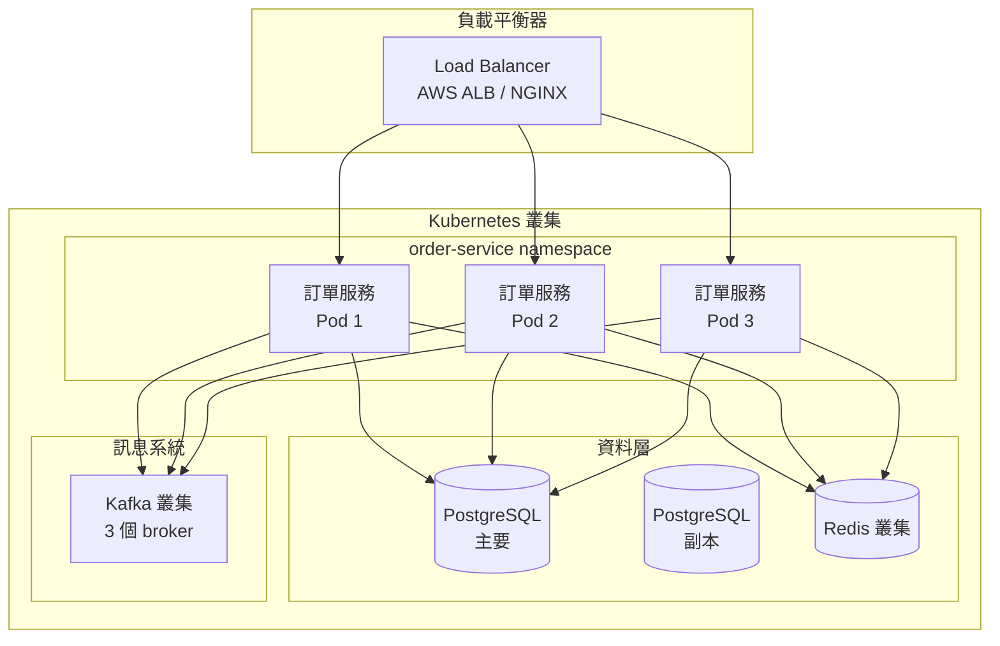

# 架構文件範本（部署）

## 09-部署架構.md 範本

```markdown
---
title: 部署架構
date: YYYY-MM-DD
---

# 部署架構

## 基礎設施總覽



## 容器設定

### Dockerfile

```dockerfile
# 多階段建置以最佳化映像大小
FROM maven:3.9-eclipse-temurin-21 AS builder

WORKDIR /app
COPY pom.xml .
COPY src ./src

RUN mvn clean package -DskipTests

FROM eclipse-temurin:21-jre-alpine

WORKDIR /app

# 建立非 root 使用者
RUN addgroup -S spring && adduser -S spring -G spring
USER spring:spring

# 從 builder 複製製品
COPY --from=builder /app/target/*.jar app.jar

# 健康檢查
HEALTHCHECK --interval=30s --timeout=3s --start-period=60s \
    CMD wget --no-verbose --tries=1 --spider http://localhost:8080/actuator/health || exit 1

EXPOSE 8080

ENTRYPOINT ["java", \
    "-XX:+UseContainerSupport", \
    "-XX:MaxRAMPercentage=75.0", \
    "-jar", "app.jar"]
```

### Docker Compose（本地開發）

```yaml
version: '3.8'

services:
  order-service:
    build: .
    ports:
      - "8080:8080"
    environment:
      SPRING_PROFILES_ACTIVE: dev
      DB_URL: jdbc:postgresql://postgres:5432/order_db
      KAFKA_BOOTSTRAP_SERVERS: kafka:9092
      REDIS_HOST: redis
    depends_on:
      - postgres
      - kafka
      - redis
  
  postgres:
    image: postgres:16-alpine
    environment:
      POSTGRES_DB: order_db
      POSTGRES_USER: orderuser
      POSTGRES_PASSWORD: orderpass
    ports:
      - "5432:5432"
    volumes:
      - postgres_data:/var/lib/postgresql/data
  
  redis:
    image: redis:7-alpine
    ports:
      - "6379:6379"
  
  kafka:
    image: confluentinc/cp-kafka:7.5.0
    ports:
      - "9092:9092"
    environment:
      KAFKA_BROKER_ID: 1
      KAFKA_ZOOKEEPER_CONNECT: zookeeper:2181
      KAFKA_ADVERTISED_LISTENERS: PLAINTEXT://kafka:9092

volumes:
  postgres_data:
```

## Kubernetes 部署

### Deployment Manifest

```yaml
apiVersion: apps/v1
kind: Deployment
metadata:
  name: order-service
  namespace: order-service
  labels:
    app: order-service
    version: v1.0.0
spec:
  replicas: 3
  strategy:
    type: RollingUpdate
    rollingUpdate:
      maxSurge: 1
      maxUnavailable: 0
  selector:
    matchLabels:
      app: order-service
  template:
    metadata:
      labels:
        app: order-service
        version: v1.0.0
    spec:
      containers:
      - name: order-service
        image: myregistry/order-service:1.0.0
        ports:
        - containerPort: 8080
          name: http
        env:
        - name: SPRING_PROFILES_ACTIVE
          value: "prod"
        - name: DB_URL
          valueFrom:
            secretKeyRef:
              name: order-db-secret
              key: url
        resources:
          requests:
            memory: "512Mi"
            cpu: "250m"
          limits:
            memory: "2Gi"
            cpu: "1000m"
        livenessProbe:
          httpGet:
            path: /actuator/health/liveness
            port: 8080
          initialDelaySeconds: 60
          periodSeconds: 10
        readinessProbe:
          httpGet:
            path: /actuator/health/readiness
            port: 8080
          initialDelaySeconds: 30
          periodSeconds: 5
```

### Service Manifest

```yaml
apiVersion: v1
kind: Service
metadata:
  name: order-service
  namespace: order-service
spec:
  type: ClusterIP
  ports:
  - port: 80
    targetPort: 8080
    protocol: TCP
  selector:
    app: order-service
```

### Ingress Manifest

```yaml
apiVersion: networking.k8s.io/v1
kind: Ingress
metadata:
  name: order-service-ingress
  namespace: order-service
  annotations:
    nginx.ingress.kubernetes.io/rewrite-target: /
    nginx.ingress.kubernetes.io/rate-limit: "100"
spec:
  ingressClassName: nginx
  tls:
  - hosts:
    - api.example.com
    secretName: api-tls-secret
  rules:
  - host: api.example.com
    http:
      paths:
      - path: /api/v1/orders
        pathType: Prefix
        backend:
          service:
            name: order-service
            port:
              number: 80
```

### ConfigMap

```yaml
apiVersion: v1
kind: ConfigMap
metadata:
  name: order-service-config
  namespace: order-service
data:
  application.yaml: |
    server:
      port: 8080
      shutdown: graceful
    
    spring:
      lifecycle:
        timeout-per-shutdown-phase: 30s
    
    management:
      endpoints:
        web:
          exposure:
            include: health,info,metrics,prometheus
```

## 水平 Pod 自動擴展器

```yaml
apiVersion: autoscaling/v2
kind: HorizontalPodAutoscaler
metadata:
  name: order-service-hpa
  namespace: order-service
spec:
  scaleTargetRef:
    apiVersion: apps/v1
    kind: Deployment
    name: order-service
  minReplicas: 3
  maxReplicas: 10
  metrics:
  - type: Resource
    resource:
      name: cpu
      target:
        type: Utilization
        averageUtilization: 70
  - type: Resource
    resource:
      name: memory
      target:
        type: Utilization
        averageUtilization: 80
```

## CI/CD Pipeline

### GitHub Actions Workflow

```yaml
name: 建置與部署

on:
  push:
    branches: [ main, develop ]
  pull_request:
    branches: [ main ]

env:
  REGISTRY: ghcr.io
  IMAGE_NAME: ${{ github.repository }}

jobs:
  build:
    runs-on: ubuntu-latest
    
    steps:
    - uses: actions/checkout@v4
    
    - name: 設定 JDK 21
      uses: actions/setup-java@v4
      with:
        java-version: '21'
        distribution: 'temurin'
        cache: 'maven'
    
    - name: 使用 Maven 建置
      run: mvn clean package -DskipTests
    
    - name: 執行測試
      run: mvn test
    
    - name: 登入容器登錄檔
      uses: docker/login-action@v3
      with:
        registry: ${{ env.REGISTRY }}
        username: ${{ github.actor }}
        password: ${{ secrets.GITHUB_TOKEN }}
    
    - name: 建置並推送 Docker 映像
      uses: docker/build-push-action@v5
      with:
        context: .
        push: true
        tags: ${{ env.REGISTRY }}/${{ env.IMAGE_NAME }}:${{ github.sha }}
  
  deploy-prod:
    needs: build
    runs-on: ubuntu-latest
    if: github.ref == 'refs/heads/main'
    environment: production
    
    steps:
    - name: 部署至生產環境
      run: |
        kubectl set image deployment/order-service \
          order-service=${{ env.REGISTRY }}/${{ env.IMAGE_NAME }}:${{ github.sha }}
```

## 環境設定

### 開發環境
- **目的**：本地開發與測試
- **基礎設施**：Docker Compose
- **資料庫**：容器中的 PostgreSQL
- **外部服務**：模擬或測試實例

### 預備環境
- **目的**：生產前驗證
- **基礎設施**：Kubernetes 叢集（較小）
- **資料庫**：雲端管理的 PostgreSQL
- **外部服務**：預備實例
- **副本數**：2 個 pod

### 生產環境
- **目的**：即時使用者流量
- **基礎設施**：Kubernetes 叢集（生產等級）
- **資料庫**：雲端管理的 PostgreSQL 含讀取副本
- **外部服務**：生產實例
- **副本數**：3-10 個 pod（自動擴展）
- **高可用性**：多可用區部署

## 監控與告警

### Prometheus ServiceMonitor

```yaml
apiVersion: monitoring.coreos.com/v1
kind: ServiceMonitor
metadata:
  name: order-service
  namespace: order-service
spec:
  selector:
    matchLabels:
      app: order-service
  endpoints:
  - port: http
    path: /actuator/prometheus
    interval: 30s
```

### Grafana 儀表板
- 應用指標（請求率、錯誤率、延遲）
- JVM 指標（堆使用、GC）
- 業務指標（已下訂單、營收）

### 告警規則

```yaml
apiVersion: monitoring.coreos.com/v1
kind: PrometheusRule
metadata:
  name: order-service-alerts
  namespace: order-service
spec:
  groups:
  - name: order-service
    rules:
    - alert: 高錯誤率
      expr: rate(http_server_requests_seconds_count{status=~"5..", job="order-service"}[5m]) > 0.05
      for: 5m
      labels:
        severity: critical
      annotations:
        summary: "訂單服務高錯誤率"
    
    - alert: 高延遲
      expr: histogram_quantile(0.95, rate(http_server_requests_seconds_bucket{job="order-service"}[5m])) > 1
      for: 5m
      labels:
        severity: warning
      annotations:
        summary: "高延遲（p95 > 1s）"
```

## 災難復原

### 備份策略
- **頻率**：每日完整備份，每小時增量
- **保留**：30 天
- **儲存**：S3 / 雲端儲存（加密）
- **測試**：每月復原演練

### 復原程序

1. **資料庫還原**：
   ```bash
   kubectl exec -it postgres-0 -- psql -U postgres -c \
     "pg_restore -d order_db /backups/order_db_2024-01-01.dump"
   ```

2. **應用程式回滾**：
   ```bash
   kubectl rollout undo deployment/order-service -n order-service
   ```

3. **流量轉移**：
   - DNS 容錯移轉至次要區域
   - 負載平衡器重新設定
```
