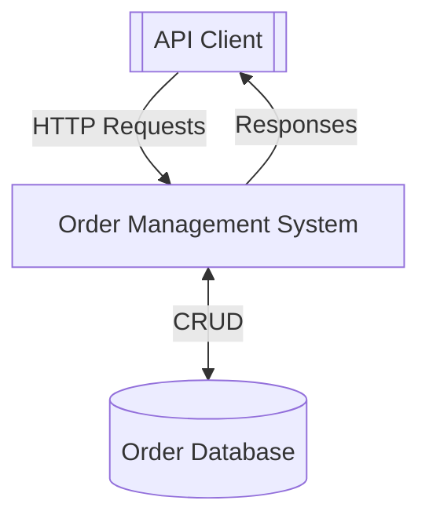
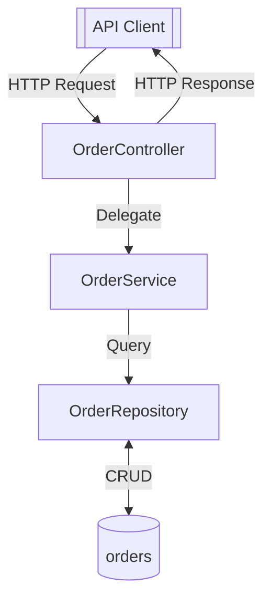

# DFD Analyzer Skill - 使用說明

## 概述

DFD Analyzer 是一個 Claude Skill，專門用於分析 Java/Spring Boot 專案並自動產生資料流程圖（Data Flow Diagram）。

## 功能特色

### 1. 自動化專案分析
- 掃描 Spring Boot 程式碼結構
- 識別 Controllers、Services、Repositories
- 偵測外部整合（Feign Clients、Kafka）
- 追蹤資料流向和依賴關係

### 2. 多層級 DFD 生成
- **Level 0 (Context Diagram)**: 系統邊界圖
- **Level 1 (High-Level DFD)**: 主要元件流程圖
- **Level 2 (Detailed DFD)**: 詳細處理程序圖

### 3. Mermaid 圖表輸出
- 可直接在 Markdown 中渲染
- 支援 GitHub、GitLab、Notion 等平台
- 便於版本控制和協作

## 安裝與使用

### 1. 安裝 Skill

將 `dfd-analyzer.skill` 檔案上傳到 Claude：
1. 在 Claude 對話中上傳 skill 檔案
2. Claude 會自動識別並啟用這個 skill

### 2. 基本使用流程

#### 步驟 1: 上傳專案或提供路徑

```
請分析這個 Spring Boot 專案並產生 DFD
```

或者如果專案在本地：
```
分析 /path/to/my-spring-boot-project 並產生資料流程圖
```

#### 步驟 2: 選擇 DFD 層級

```
請產生：
1. Level 0 的 Context Diagram
2. Level 1 的詳細 DFD
```

#### 步驟 3: 取得文件與圖表

Claude 會產生包含以下內容的文件：
- 系統架構說明
- Context Diagram (Mermaid)
- High-Level DFD (Mermaid)
- 元件清單與說明
- 關鍵資料流分析

## 使用範例

### 範例 1: 分析簡單的 REST API 專案

**使用者請求:**
```
我有一個訂單管理系統，包含 OrderController、OrderService、OrderRepository。
請幫我產生 DFD。
```

**Claude 會產生:**

1. **專案分析結果 (JSON)**
```json
{
  "external_entities": [
    {"name": "API Client", "type": "client"}
  ],
  "processes": [
    {"name": "OrderController", "type": "controller"},
    {"name": "OrderService", "type": "service"},
    {"name": "OrderRepository", "type": "repository"}
  ],
  "data_stores": [
    {"name": "orders", "type": "database"}
  ],
  "data_flows": [...]
}
```

2. **Context Diagram (Level 0)**


3. **Detailed DFD (Level 1)**


### 範例 2: 微服務架構分析

**使用者請求:**
```
分析這個包含 Order Service、Payment Service、Inventory Service 的微服務專案，
並產生完整的 DFD 文件。
```

**Claude 會:**
1. 掃描各個服務的程式碼
2. 識別 Feign Client 和外部 API 呼叫
3. 分析跨服務的資料流
4. 產生整合的 DFD 圖表
5. 提供詳細的架構說明文件

## 進階功能

### 1. 自訂分析規則

如果你有自訂的 Spring 註解，可以擴展分析腳本：

```python
# 在 analyze_project.py 中新增
elif re.search(r'@CustomProcessor', content):
    self._analyze_custom_processor(class_name, content, relative_path)
```

### 2. CI/CD 整合

將 DFD 生成加入 CI/CD pipeline：

```yaml
# .github/workflows/docs.yml
- name: Generate DFD
  run: |
    python dfd-analyzer/scripts/analyze_project.py ./src > analysis.json
    python dfd-analyzer/scripts/generate_mermaid.py analysis.json > docs/dfd.mmd
```

### 3. 多模組專案處理

```bash
# 分析各模組
python scripts/analyze_project.py ./order-service > order.json
python scripts/analyze_project.py ./payment-service > payment.json

# 產生各自的 DFD
python scripts/generate_mermaid.py order.json > order-dfd.mmd
python scripts/generate_mermaid.py payment.json > payment-dfd.mmd
```

## DFD 元件對應表

| Spring Boot 元素 | DFD 元件 | 圖形表示 |
|-----------------|---------|---------|
| `@RestController` | 外部實體/處理程序 | `[[ ]]` / `[ ]` |
| `@FeignClient` | 外部實體 | `[[ ]]` |
| `@Service` | 處理程序 | `[ ]` |
| `@Repository` | 處理程序 | `[ ]` |
| `@Entity` | 資料儲存 | `[(( ))]` |
| `@Cacheable` | 資料儲存 | `[(( ))]` |
| `@Autowired` | 資料流 | `-->` |

## 最佳實踐

### 1. 程式碼組織
- 使用清晰的套件結構
- 遵循標準的 Spring Boot 分層架構
- 明確的類別和方法命名

### 2. DFD 層級選擇
- **Level 0**: 用於高階主管報告、系統概覽
- **Level 1**: 用於開發者文件、架構審查
- **Level 2**: 用於深入技術分析、除錯

### 3. 文件維護
- 將 DFD 納入版本控制
- 程式碼變更時同步更新 DFD
- 在 Architecture Decision Records (ADR) 中引用 DFD

## 疑難排解

### 問題 1: 某些元件沒被偵測到

**解決方案:**
- 確認使用標準 Spring 註解
- 檢查檔案編碼是否為 UTF-8
- 查看分析腳本的正規表達式

### 問題 2: 圖表太複雜

**解決方案:**
- 使用 Level 0 Context Diagram
- 依套件或層級分別產生圖表
- 針對特定子系統產生 Level 2 詳細圖

### 問題 3: 資料流不正確

**解決方案:**
- 檢查依賴注入是否正確
- 驗證 `@Autowired` 註解
- 手動審查關鍵流程

## 參考資料

### Skill 內建文件

1. **spring_boot_patterns.md**
   - Spring Boot 架構模式對應
   - 常見架構類型（分層、微服務、事件驅動）
   - DFD 各層級最佳實踐

2. **dfd_examples.md**
   - 完整電商系統範例
   - Level 0, 1, 2 圖表與程式碼對應
   - 常見錯誤與解決方案

### 外部資源

- [Mermaid 官方文件](https://mermaid.js.org/)
- [Spring Boot 文件](https://spring.io/projects/spring-boot)
- [DDD with Spring](https://github.com/ddd-by-examples)

## 技術支援

遇到問題？可以：
1. 查看 skill 內的 reference 文件
2. 向 Claude 詢問具體使用問題
3. 調整分析腳本以符合你的專案結構

## 版本資訊

- **Version**: 1.0.0
- **支援的 Spring Boot 版本**: 2.x, 3.x
- **支援的 Java 版本**: 8+
- **輸出格式**: Mermaid Flowchart

---

享受自動化 DFD 生成的便利！🚀
