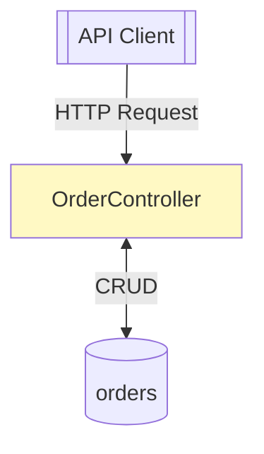

# DFD Analyzer - 快速入門指南

## 5 分鐘快速開始

### 步驟 1: 安裝 Skill (1 分鐘)

將 `dfd-analyzer.skill` 上傳到 Claude 對話視窗。

### 步驟 2: 準備專案 (1 分鐘)

確保你的 Spring Boot 專案包含：

- ✅ `src/main/java` 目錄結構
- ✅ 使用 `@RestController`, `@Service`, `@Repository` 註解
- ✅ 清晰的套件組織

### 步驟 3: 請求分析 (1 分鐘)

在 Claude 對話中輸入：

```
請分析我的 Spring Boot 專案並產生 DFD 文件，包含：
1. Level 0 Context Diagram
2. Level 1 Detailed DFD  
3. 元件說明
```

### 步驟 4: 取得結果 (2 分鐘)

Claude 會產生：

- 📊 Mermaid 格式的 DFD 圖表
- 📝 完整的架構說明文件
- 📋 元件清單與資料流分析

## 常見使用情境

### 情境 1: 新專案架構設計

**目的**: 視覺化系統架構，與團隊溝通設計

**操作**:

```
請分析這個訂單管理系統專案並產生 Context Diagram，
幫我展示系統與外部實體的互動關係。
```

**輸出**: Level 0 Context Diagram，適合放在架構設計文件

### 情境 2: 開發者 Onboarding

**目的**: 幫助新成員快速理解系統架構

**操作**:

```
產生這個專案的 Level 1 DFD，
標示出 Controller → Service → Repository 的資料流。
```

**輸出**: Level 1 DFD，清楚展示各層職責

### 情境 3: 重構規劃

**目的**: 了解現有架構，規劃重構方向

**操作**:

```
分析專案中的 PaymentService，
產生詳細的 DFD 顯示它與其他元件的互動。
```

**輸出**: Level 2 詳細 DFD，聚焦特定服務

### 情境 4: 微服務拆分

**目的**: 識別服務邊界，規劃微服務拆分

**操作**:

```
分析整個專案並產生 DFD，
幫我識別可以拆分成獨立微服務的模組。
```

**輸出**: 完整分析報告，標示潛在服務邊界

### 情境 5: API 文件補充

**目的**: 在 API 文件中加入架構圖

**操作**:

```
產生 API 層的 DFD，
顯示所有 REST endpoints 和它們對應的資料流。
```

**輸出**: API 層 DFD，可整合到 Swagger/OpenAPI 文件

## 範例專案結構

### 簡單的單體應用

```
my-app/
├── src/main/java/com/example/myapp/
│   ├── controller/
│   │   ├── OrderController.java      # @RestController
│   │   └── ProductController.java    # @RestController
│   ├── service/
│   │   ├── OrderService.java         # @Service
│   │   └── ProductService.java       # @Service
│   ├── repository/
│   │   ├── OrderRepository.java      # @Repository
│   │   └── ProductRepository.java    # @Repository
│   └── entity/
│       ├── Order.java                # @Entity
│       └── Product.java              # @Entity
```

**分析結果預覽**:

- 2 個外部實體（API Client）
- 6 個處理程序（2 Controllers, 2 Services, 2 Repositories）
- 2 個資料儲存（orders, products）

### 微服務架構

```
order-service/
├── src/main/java/com/example/order/
│   ├── controller/OrderController.java
│   ├── service/OrderService.java
│   ├── client/
│   │   ├── PaymentClient.java        # @FeignClient
│   │   └── InventoryClient.java      # @FeignClient
│   └── repository/OrderRepository.java

payment-service/
├── src/main/java/com/example/payment/
│   ├── controller/PaymentController.java
│   ├── service/PaymentService.java
│   └── repository/TransactionRepository.java
```

**分析結果預覽**:

- 多個外部實體（跨服務 Feign Clients）
- 服務間的資料流
- 各服務獨立的資料儲存

## 實用指令範例

### 基本分析

```bash
# 分析專案
python scripts/analyze_project.py ./my-spring-boot-app > analysis.json

# 產生 DFD
python scripts/generate_mermaid.py analysis.json > dfd.mmd

# 產生 Context Diagram
python scripts/generate_mermaid.py analysis.json --context > context.mmd
```

### 在 Claude 中直接使用

```
# 範例 1: 完整分析
請分析我上傳的 Spring Boot 專案，產生完整的 DFD 文件。

# 範例 2: 只要 Context Diagram
請產生這個專案的 Level 0 Context Diagram。

# 範例 3: 聚焦特定模組
請分析 order 套件，產生詳細的 DFD。

# 範例 4: 比較兩個版本
請分析 v1 和 v2 兩個版本的專案，
比較它們的架構變化。
```

## 輸出格式說明

### Mermaid 語法



### 在 Markdown 中使用

```markdown
## 系統架構

```mermaid
[貼上產生的 Mermaid 程式碼]
```

```
### 支援平台

- ✅ GitHub README
- ✅ GitLab Wiki
- ✅ Notion
- ✅ Confluence
- ✅ VS Code (with Mermaid Preview)
- ✅ draw.io (可匯入 Mermaid)

## 進階技巧

### 技巧 1: 分層產生圖表
```

1. 先產生 Level 0，確認系統邊界

2. 再產生 Level 1，展開主要元件

3. 針對複雜模組產生 Level 2
   
   ```
   
   ```

### 技巧 2: 結合 ADR

在 Architecture Decision Record 中引用 DFD：

```markdown
# ADR 001: 採用分層架構

## Context
[說明]

## Decision
採用 Controller → Service → Repository 分層架構

## Consequences


[DFD 清楚展示了各層職責]
```

### 技巧 3: 版本控制

```bash
# 建立 docs/ 目錄存放 DFD
docs/
├── dfd/
    └── diagrams/
         ├── context-diagram.mmd
         ├── level1-dfd.mmd
     └── payment-service-detail.mmd
```

### 技巧 4: 自動化更新

```yaml
# GitHub Actions
name: Update DFD
on:
  push:
    paths:
      - 'src/**/*.java'
jobs:
  update-dfd:
    runs-on: ubuntu-latest
    steps:
      - uses: actions/checkout@v2
      - name: Generate DFD
        run: |
          python dfd-analyzer/scripts/analyze_project.py ./src > analysis.json
          python dfd-analyzer/scripts/generate_mermaid.py analysis.json > docs/dfd.mmd
      - name: Commit changes
        run: |
          git config user.name "GitHub Actions"
          git commit -am "Update DFD" || exit 0
          git push
```

## 常見問題 (FAQ)

### Q1: Skill 支援哪些框架？

**A**: 主要支援 Spring Boot，也可用於：

- Spring MVC
- Spring Cloud 微服務
- 任何使用標準 Spring 註解的 Java 專案

### Q2: 可以分析 Kotlin 專案嗎？

**A**: 可以，只要使用 Spring 註解即可。
需要微調分析腳本的正規表達式。

### Q3: 如何處理大型專案？

**A**: 

1. 依模組/套件分別分析
2. 產生多個 DFD 而非單一大圖
3. 使用 Level 0 展示整體，Level 2 展示細節

### Q4: 生成的圖表可以編輯嗎？

**A**: 可以！

1. Mermaid 是文字格式，直接編輯
2. 或匯入到 draw.io 等工具視覺化編輯

### Q5: 如何確保 DFD 與程式碼同步？

**A**:

1. 將 DFD 生成加入 CI/CD
2. Code Review 時檢查 DFD
3. 重大架構變更時更新 DFD

## 下一步

1. ✅ 上傳 `dfd-analyzer.skill` 到 Claude
2. ✅ 準備一個 Spring Boot 專案
3. ✅ 請 Claude 產生第一個 DFD
4. 📖 閱讀完整使用說明
5. 🚀 整合到開發流程中

---

**需要幫助？** 直接在 Claude 對話中詢問關於 DFD Analyzer 的問題！
