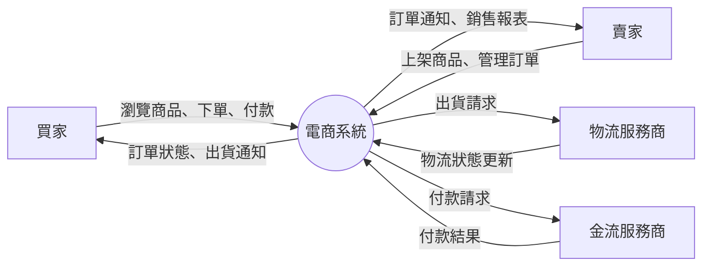
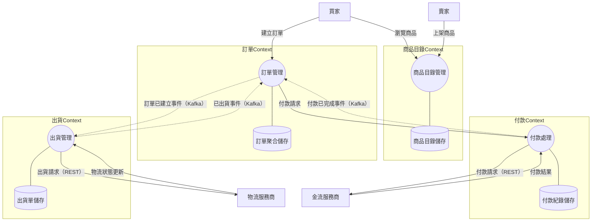
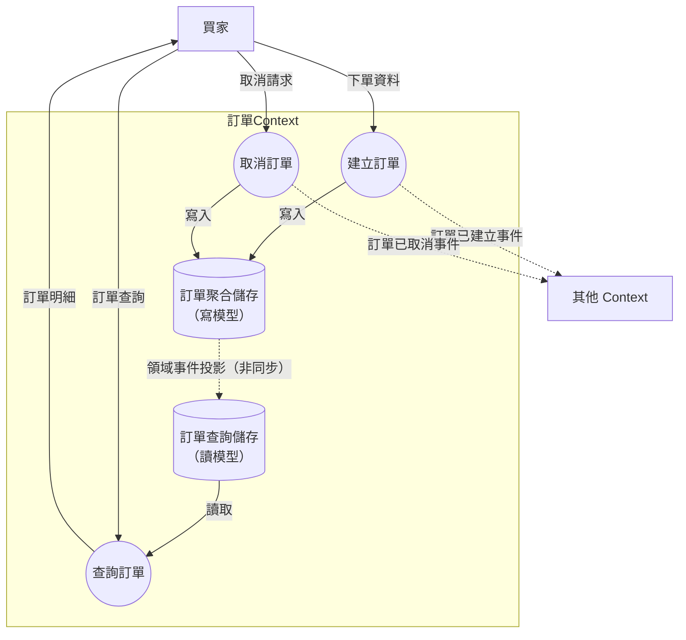
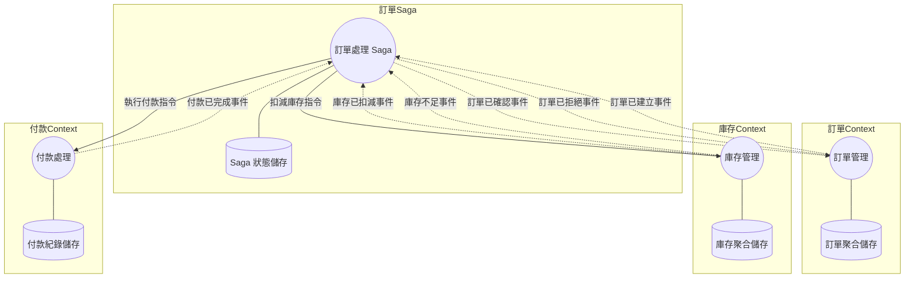

# Mermaid DFD 繪圖範例

## 繪圖慣例

DFD 以 Mermaid `flowchart` 語法繪製，使用以下慣例：

| DFD 元素 | Mermaid 語法 | 形狀 |
|---------|-------------|------|
| 外部實體 | `entity["名稱"]` | 方括號（矩形） |
| Process | `process(("名稱"))` | 雙括號（圓形） |
| Data Store | `store[("名稱")]` | 圓柱體（資料庫形狀） |
| 同步資料流 | `-->｜標籤｜` | 實線箭頭 |
| 非同步資料流 | `-.->｜標籤｜` | 虛線箭頭 |
| Bounded Context | `subgraph` | 分組框 |

## Level 0 範例：電商系統

## Level 1 範例：電商系統 Bounded Context 分解

## Level 2 範例：訂單 Context 內部展開

## 進階：Saga 流程範例

## 樣式建議

- 使用 `TB`（上到下）或 `LR`（左到右）方向，依圖表複雜度選擇
- Level 0 適合 `LR`，Level 1+ 適合 `TB`
- `subgraph` 標題使用 Bounded Context 名稱
- 虛線箭頭（`-.->`)）一律用於非同步資料流
- 資料流標籤簡潔，格式為 `{內容}（{機制}）`
