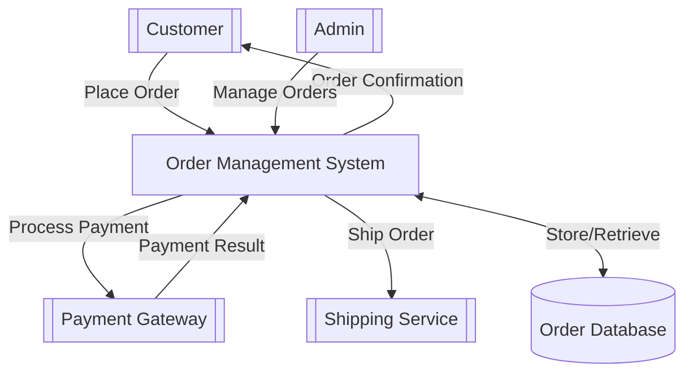
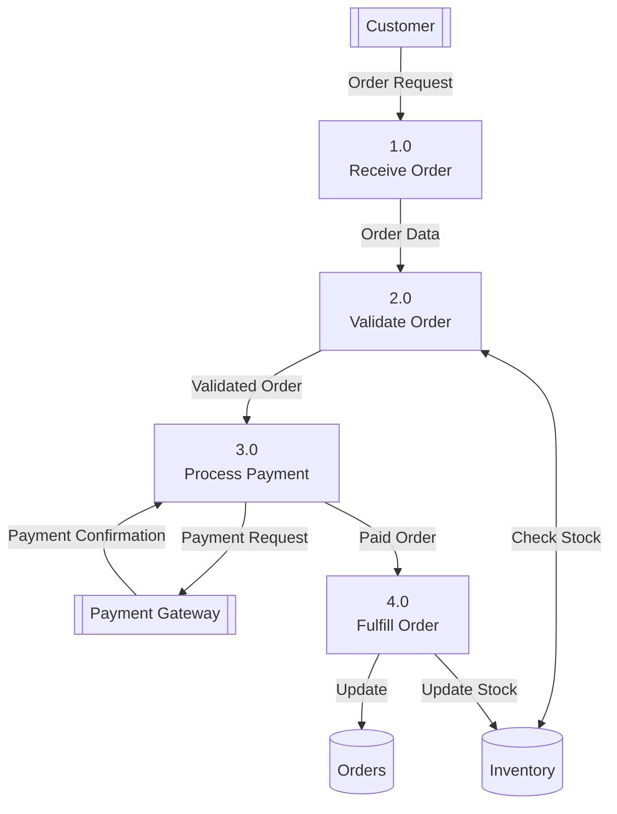
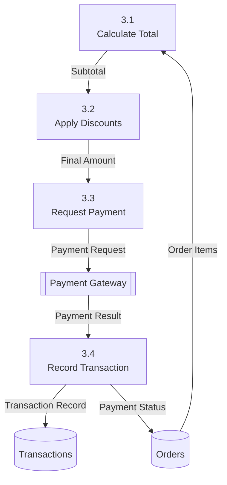
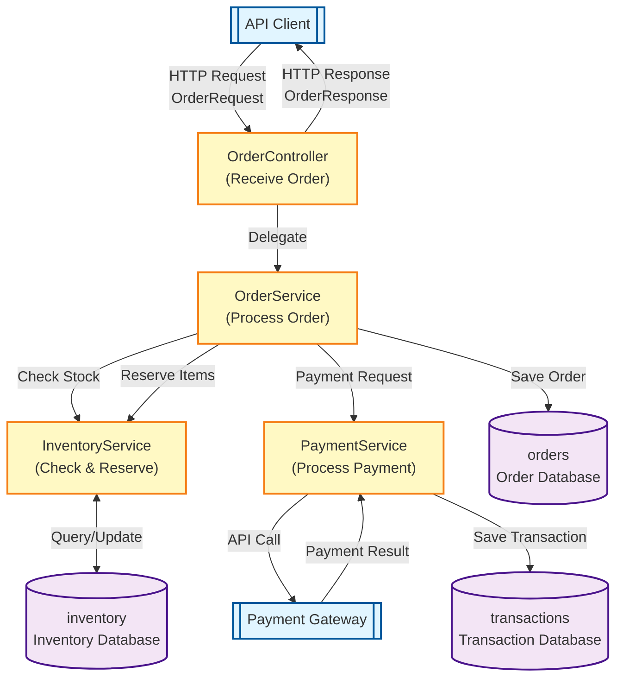

# DFD Examples and Best Practices

## Complete Example: E-commerce Order System

### Level 0: Context Diagram



**Purpose**: Shows the system in context with its environment.

**Key Elements**:
- External entities: Customer, Admin, Payment Gateway, Shipping Service
- Single process: Order Management System
- Data store: Order Database
- Data flows: Bidirectional between system and externals

### Level 1: Process Decomposition



**Purpose**: Shows major processes within the system.

**Key Elements**:
- Numbered processes (1.0, 2.0, etc.)
- Multiple data stores (Orders, Inventory)
- Data flows between processes
- External entities interact with specific processes

### Level 2: Detailed Process (Example: Process Payment)



**Purpose**: Shows detailed steps within a single process.

**Key Elements**:
- Sub-processes (3.1, 3.2, 3.3, 3.4)
- Detailed data transformations
- Fine-grained data flows

## Spring Boot Code Example

```java
// External Entity: API Client
@RestController
@RequestMapping("/api/orders")
public class OrderController {
    
    @Autowired
    private OrderService orderService;
    
    // Process 1.0: Receive Order
    @PostMapping
    public ResponseEntity<OrderResponse> createOrder(
            @RequestBody OrderRequest request) {
        Order order = orderService.processOrder(request);
        return ResponseEntity.ok(new OrderResponse(order));
    }
}

// Process 2.0-4.0: Business Logic
@Service
public class OrderService {
    
    @Autowired
    private OrderRepository orderRepository;
    
    @Autowired
    private InventoryService inventoryService;
    
    @Autowired
    private PaymentService paymentService;
    
    public Order processOrder(OrderRequest request) {
        // Process 2.0: Validate Order
        validateOrder(request);
        
        // Check inventory (Data Flow to Inventory data store)
        inventoryService.checkAvailability(request.getItems());
        
        // Process 3.0: Process Payment
        PaymentResult payment = paymentService.processPayment(request);
        
        if (!payment.isSuccessful()) {
            throw new PaymentFailedException();
        }
        
        // Process 4.0: Fulfill Order
        Order order = createOrderEntity(request);
        
        // Data Flow to Order data store
        order = orderRepository.save(order);
        
        // Update inventory (Data Flow to Inventory data store)
        inventoryService.reserveItems(request.getItems());
        
        return order;
    }
    
    private void validateOrder(OrderRequest request) {
        // Validation logic
    }
    
    private Order createOrderEntity(OrderRequest request) {
        // Entity creation logic
    }
}

// Data Store: Order Database
@Entity
@Table(name = "orders")
public class Order {
    @Id
    @GeneratedValue(strategy = GenerationType.IDENTITY)
    private Long id;
    
    private String customerId;
    private BigDecimal totalAmount;
    private String status;
    
    @OneToMany(cascade = CascadeType.ALL)
    private List<OrderItem> items;
}

@Repository
public interface OrderRepository extends JpaRepository<Order, Long> {
    List<Order> findByCustomerId(String customerId);
}

// External Entity: Payment Gateway
@FeignClient(name = "payment-service", url = "${payment.service.url}")
public interface PaymentClient {
    @PostMapping("/process")
    PaymentResult processPayment(@RequestBody PaymentRequest request);
}

@Service
public class PaymentService {
    
    @Autowired
    private PaymentClient paymentClient;
    
    @Autowired
    private TransactionRepository transactionRepository;
    
    // Process 3.0: Process Payment (detailed)
    public PaymentResult processPayment(OrderRequest orderRequest) {
        // Process 3.1: Calculate Total
        BigDecimal total = calculateTotal(orderRequest);
        
        // Process 3.2: Apply Discounts
        BigDecimal finalAmount = applyDiscounts(total, orderRequest);
        
        // Process 3.3: Request Payment (Data Flow to Payment Gateway)
        PaymentRequest paymentRequest = new PaymentRequest(
            finalAmount,
            orderRequest.getPaymentMethod()
        );
        
        PaymentResult result = paymentClient.processPayment(paymentRequest);
        
        // Process 3.4: Record Transaction (Data Flow to Transaction data store)
        Transaction transaction = new Transaction(
            result.getTransactionId(),
            finalAmount,
            result.getStatus()
        );
        transactionRepository.save(transaction);
        
        return result;
    }
    
    private BigDecimal calculateTotal(OrderRequest request) {
        return request.getItems().stream()
            .map(item -> item.getPrice().multiply(
                BigDecimal.valueOf(item.getQuantity())))
            .reduce(BigDecimal.ZERO, BigDecimal::add);
    }
    
    private BigDecimal applyDiscounts(BigDecimal total, OrderRequest request) {
        if (request.getDiscountCode() != null) {
            return total.multiply(BigDecimal.valueOf(0.9)); // 10% off
        }
        return total;
    }
}
```

## Corresponding Mermaid DFD



## Best Practices

### 1. Naming Conventions

**Good Process Names:**
- Use verb phrases: "Validate Order", "Calculate Total", "Process Payment"
- Be specific: "Send Email Notification" not just "Send Email"
- Include business context: "Apply Loyalty Discount" not just "Apply Discount"

**Good Data Flow Labels:**
- Describe the data: "Order Request", "Payment Result", "Customer Profile"
- Not just "Data" or "Information"

**Good Data Store Names:**
- Use plural nouns: "Orders", "Customers", "Transactions"
- Include type if needed: "Order Cache", "Event Queue"

### 2. Appropriate Level of Detail

**Level 0**: 1 system, key externals, major data stores
**Level 1**: 5-9 major processes, key data stores
**Level 2**: Detailed breakdown of 1 process from Level 1

Don't try to show everything in one diagram!

### 3. Data Flow Documentation

Always document:
- What data is flowing (DTO, Entity, primitive)
- Direction (arrows)
- Trigger (event-driven, request-response, scheduled)

Example annotation:
```
OrderService -->|OrderDTO<br/>(on create request)| OrderRepository
```

### 4. Handling Complexity

**For Complex Systems:**
- Create multiple diagrams for different aspects
- One for synchronous flows
- One for event-driven flows
- One for batch processes

**Use Sub-Diagrams:**
```
Main DFD shows: "Payment Processing"
Separate detailed DFD shows: "Payment Processing" broken down into:
- Validate Payment Method
- Calculate Fees
- Execute Transaction
- Update Accounts
```

### 5. Version Control

Keep DFD in sync with code:
- Generate from code when possible
- Update diagrams with architecture changes
- Include in documentation and ADRs (Architecture Decision Records)

### 6. Team Communication

Use DFD for:
- Onboarding new developers
- API design discussions
- Performance bottleneck identification
- Security review (data flow analysis)
- Microservice boundary decisions

## Common Mistakes to Avoid

1. **Too Many Processes**: If you have more than 10 processes in a single level, consider grouping or going to a higher level

2. **Missing Data Stores**: Every persistent data needs a data store symbol

3. **Unlabeled Flows**: Every arrow should have a label describing what data flows

4. **Mixing Levels**: Don't mix high-level and low-level details in the same diagram

5. **Ignoring Error Paths**: Show error flows and exception handling where critical

6. **Physical Implementation Details**: Focus on logical data flow, not physical (servers, networks)

## Tools and Automation

- **Mermaid**: Best for version-controlled, text-based diagrams
- **PlantUML**: Good for complex diagrams with many elements
- **draw.io**: For manual, visual editing
- **Enterprise Architect**: For large-scale enterprise modeling

For Spring Boot projects, consider:
- Static code analysis to extract components
- Annotation scanning to identify layers
- Dependency graphs from build tools (Maven/Gradle)
