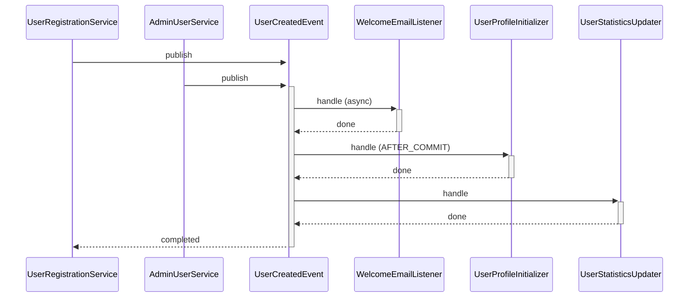

# {EventName}

## 📋 基本資訊

- **Package**: `com.example.domain.event`
- **Bounded Context**: User Management
- **檔案路徑**: `src/main/java/com/example/user/domain/event/UserCreatedEvent.java`
- **類型**: Java Record
- **繼承**: `ApplicationEvent`
- **註解**: `@DomainEvent`

## 📖 說明

當新使用者成功註冊並建立帳戶時觸發此事件。此事件標記著使用者生命週期的開始，會觸發後續的歡迎郵件發送、預設設定初始化等流程。

## 🔧 欄位定義

| 欄位名稱 | 型別 | 說明 | 註解 |
|---------|------|------|------|
| userId | `UUID` | 使用者唯一識別碼 | `@NotNull` |
| email | `String` | 使用者電子郵件 | `@Email`, `@NotBlank` |
| username | `String` | 使用者名稱 | `@NotBlank`, `@Size(min=3, max=50)` |
| createdAt | `Instant` | 建立時間 | `@NotNull` |
| source | `RegistrationSource` | 註冊來源 (WEB, MOBILE, API) | `@NotNull` |

## 📤 Publisher (事件發送者)

此事件由 **2** 個地方發送:

### 1. UserRegistrationService.registerUser()

- **檔案**: `service/UserRegistrationService.java`
- **行號**: 45
- **Package**: `com.example.user.service`

**程式碼片段**:
```java
    // 儲存使用者
    User savedUser = userRepository.save(user);
    
>>> applicationEventPublisher.publishEvent(new UserCreatedEvent(
        savedUser.getId(),
        savedUser.getEmail(),
        savedUser.getUsername(),
        Instant.now(),
        RegistrationSource.WEB
    ));
    
    return savedUser;
```

### 2. AdminUserService.createUserByAdmin()

- **檔案**: `service/AdminUserService.java`
- **行號**: 78
- **Package**: `com.example.user.service`

**程式碼片段**:
```java
    User adminCreatedUser = userRepository.save(user);
    
>>> eventPublisher.publish(new UserCreatedEvent(
        adminCreatedUser.getId(),
        adminCreatedUser.getEmail(),
        adminCreatedUser.getUsername(),
        Instant.now(),
        RegistrationSource.ADMIN
    ));
```

## 📥 Listener (事件監聽者)

此事件被 **3** 個 Listener 監聽:

### 1. WelcomeEmailListener.sendWelcomeEmail()

- **檔案**: `listener/WelcomeEmailListener.java`
- **行號**: 25
- **Package**: `com.example.notification.listener`
- **執行特性**: 🔄 異步執行

**說明**: 發送歡迎郵件給新註冊的使用者

### 2. UserProfileInitializer.initializeProfile()

- **檔案**: `listener/UserProfileInitializer.java`
- **行號**: 33
- **Package**: `com.example.user.listener`
- **執行特性**: 🔒 事務性 (AFTER_COMMIT)

**說明**: 初始化使用者的預設設定和偏好

### 3. UserStatisticsUpdater.incrementUserCount()

- **檔案**: `listener/UserStatisticsUpdater.java`
- **行號**: 41
- **Package**: `com.example.analytics.listener`

**說明**: 更新系統的使用者統計數據

## 📊 事件流程圖



## 💡 使用場景

此事件通常在以下情況下觸發:

1. **一般使用者註冊**
   - 使用者透過網頁或行動 App 完成註冊流程
   - 驗證郵箱後啟用帳戶

2. **管理員建立帳戶**
   - 系統管理員為其他使用者建立帳戶
   - 批次匯入使用者時

3. **第三方整合**
   - 透過 OAuth 註冊的使用者
   - API 整合建立的帳戶

## 🔗 相關事件

- `UserEmailVerifiedEvent` - 使用者驗證郵箱後觸發
- `UserProfileUpdatedEvent` - 使用者更新個人資料時觸發
- `UserActivatedEvent` - 使用者帳戶啟用時觸發
- `UserDeactivatedEvent` - 使用者帳戶停用時觸發

**事件鏈**:
```
UserCreatedEvent → UserEmailVerifiedEvent → UserActivatedEvent
```

## ⚠️ 注意事項

1. **冪等性考量**
   - Listener 應實作冪等性,避免重複處理造成問題
   - 特別是發送郵件的 Listener,應檢查是否已發送過

2. **效能考量**
   - 歡迎郵件發送使用異步處理,避免阻塞主流程
   - 統計更新可考慮批次處理或使用快取

3. **錯誤處理**
   - 若郵件發送失敗,不應影響使用者註冊成功
   - 建議實作重試機制或將失敗記錄下來稍後處理

4. **資料一致性**
   - UserProfileInitializer 使用 AFTER_COMMIT 確保只在事務成功後執行
   - 避免在 Listener 中進行長時間的同步操作

## 📝 開發指南

### 新增 Listener

若要新增監聽此事件的 Listener:

```java
@Component
public class MyUserCreatedListener {
    
    @EventListener
    public void handleUserCreated(UserCreatedEvent event) {
        // 處理邏輯
    }
}
```

### 發送此事件

若要在新的地方發送此事件:

```java
@Service
public class MyService {
    
    private final ApplicationEventPublisher eventPublisher;
    
    public void someMethod() {
        // 業務邏輯
        
        eventPublisher.publishEvent(new UserCreatedEvent(
            userId,
            email,
            username,
            Instant.now(),
            source
        ));
    }
}
```

---

*文件自動產生時間: 2024-02-04 15:30:00*
*建議定期更新此文件以反映最新的程式碼狀態*
