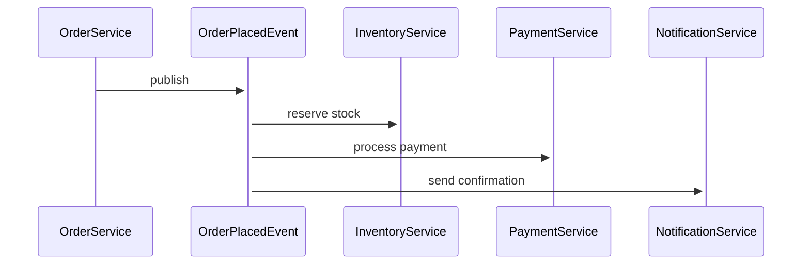

# 使用範例

## 快速開始

### 1. 基本使用

在 Spring Boot 專案根目錄執行：

```bash
python3 scripts/generate_all_docs.py \
  --source-dir src/main/java \
  --output-dir docs/event
```

執行完成後,會在 `docs/event/` 目錄下產生：

```
docs/event/
├── README.md                    # 索引頁面
├── EVENT_CATALOG.md            # 完整目錄
├── BOUNDED_CONTEXTS.md         # DDD 分類
├── events/                     # 每個 Event 的詳細文件
│   ├── UserCreatedEvent.md
│   ├── OrderPlacedEvent.md
│   └── ...
└── diagrams/                   # Mermaid 流程圖
    ├── event-overview.mmd
    ├── sequence-diagrams.mmd
    └── ...
```

### 2. 查看產生的文件

```bash
# 在 VS Code 中開啟
code docs/event/README.md

# 或使用 Markdown 預覽器
markdown-preview docs/event/README.md
```

### 3. 整合到 Git

```bash
git add docs/event/
git commit -m "docs: add Event documentation"
git push
```

## 進階使用

### 單獨執行各個步驟

如果只想執行特定的分析步驟：

```bash
# 1. 只掃描 Event
python3 scripts/scan_events.py \
  --source-dir src/main/java \
  --output event-analysis.json

# 2. 只分析 Publisher
python3 scripts/analyze_publishers.py \
  --source-dir src/main/java \
  --output publisher-analysis.json

# 3. 只分析 Listener
python3 scripts/analyze_listeners.py \
  --source-dir src/main/java \
  --output listener-analysis.json

# 4. 產生文件（需要前三步的 JSON 結果）
python3 scripts/generate_event_docs.py \
  --events event-analysis.json \
  --publishers publisher-analysis.json \
  --listeners listener-analysis.json \
  --output-dir docs/event
```

### 增量更新

只更新有變更的 Event 文件：

```bash
# 找出最近修改的 Event 相關檔案
git diff --name-only HEAD~1 | grep -i event

# 重新產生文件
python3 scripts/generate_all_docs.py \
  --source-dir src/main/java \
  --output-dir docs/event
```

### CI/CD 整合

在 `.github/workflows/event-docs.yml`:

```yaml
name: Generate Event Documentation

on:
  push:
    branches: [main, develop]
    paths:
      - 'src/**/event/**'
      - 'src/**/listener/**'

jobs:
  generate-docs:
    runs-on: ubuntu-latest
    steps:
      - uses: actions/checkout@v3
      
      - name: Set up Python
        uses: actions/setup-python@v4
        with:
          python-version: '3.11'
      
      - name: Generate Event Documentation
        run: |
          python3 scripts/generate_all_docs.py \
            --source-dir src/main/java \
            --output-dir docs/event \
            --clean
      
      - name: Commit Documentation
        run: |
          git config user.name "Event Doc Bot"
          git config user.email "bot@example.com"
          git add docs/event
          git diff --quiet && git diff --staged --quiet || \
            git commit -m "docs: update event documentation [skip ci]"
          git push
```

## 實際專案範例

### 範例 1: 電商系統

```bash
# 產生訂單相關的 Event 文件
python3 scripts/generate_all_docs.py \
  --source-dir src/main/java \
  --output-dir docs/event
```

產生的文件會包含：
- `OrderPlacedEvent.md` - 訂單建立事件
- `OrderCancelledEvent.md` - 訂單取消事件
- `PaymentProcessedEvent.md` - 付款處理事件
- `ShipmentCreatedEvent.md` - 出貨建立事件

### 範例 2: 用戶管理系統

產生的 Bounded Context 文件會顯示：

```markdown
## User Management

**事件數量**: 8
**發送者**: 3
**監聽者**: 12

### Events
- [UserCreatedEvent](events/UserCreatedEvent.md)
- [UserActivatedEvent](events/UserActivatedEvent.md)
- [UserProfileUpdatedEvent](events/UserProfileUpdatedEvent.md)
- ...
```

### 範例 3: 微服務架構

對於跨服務的事件系統,流程圖會顯示完整的事件流：



## 自訂化

### 修改文件模板

編輯 `references/event-doc-template.md` 來自訂文件格式。

### 調整掃描規則

修改 `scripts/scan_events.py` 中的 `EVENT_PATTERNS`：

```python
EVENT_PATTERNS = [
    r'class\s+\w+Event\s+extends',
    r'@MyCustomEventAnnotation',  # 加入自訂註解
    # ...
]
```

### 過濾特定 Package

```python
def _is_event_package(self, file_path: Path) -> bool:
    path_str = str(file_path)
    return any(pattern in path_str.lower() for pattern in [
        '/event/',
        '/yourdomain/event',  # 加入特定 package
    ])
```

## 疑難排解

### 問題 1: 找不到任何 Event

**檢查項目**:
1. 確認 `--source-dir` 路徑正確
2. Event 類別是否符合命名慣例
3. Event 類別是否在正確的 package 下

```bash
# 手動檢查
find src/main/java -name "*Event.java"
```

### 問題 2: Listener 沒有被偵測到

**檢查項目**:
1. 確認使用 `@EventListener` 註解
2. Listener 方法是否 public
3. 參數型別是否正確

```bash
# 手動搜尋 Listener
rg "@EventListener" --type java
```

### 問題 3: 產生的文件不完整

**解決方法**:
1. 確保 JavaDoc 註解完整
2. 檢查程式碼編碼是否為 UTF-8
3. 查看暫存目錄的 JSON 檔案內容

```bash
# 檢查分析結果
cat .event-analysis-temp/events.json | jq .
```

### 問題 4: Mermaid 圖表無法渲染

**解決方法**:
1. 檢查節點名稱是否包含特殊字元
2. 使用線上編輯器驗證: https://mermaid.live
3. 確認 Markdown 預覽器支援 Mermaid

## 性能優化

### 大型專案

對於超過 1000 個類別的專案：

```bash
# 使用並行處理（需要安裝 parallel）
find src/main/java -name "*.java" | \
  parallel -j 4 python3 scripts/analyze_file.py {}
```

### 快取機制

產生的 JSON 可以快取重複使用：

```bash
# 第一次執行
python3 scripts/generate_all_docs.py \
  --source-dir src/main/java \
  --output-dir docs/event

# 後續只更新文件（重用 JSON）
python3 scripts/generate_event_docs.py \
  --events .event-analysis-temp/events.json \
  --publishers .event-analysis-temp/publishers.json \
  --listeners .event-analysis-temp/listeners.json \
  --output-dir docs/event
```

## 最佳實踐

1. **定期更新**: 在 CI/CD 中自動執行,確保文件同步
2. **Code Review**: 將產生的文件納入 Code Review 流程
3. **補充說明**: 自動產生的文件可能需要人工補充業務說明
4. **版本控制**: 將文件放入 Git,追蹤變更歷史
5. **Wiki 整合**: 可以將產生的文件自動同步到 Confluence 等 Wiki

## 下一步

- 探索 AsyncAPI 規格產生功能
- 整合到團隊的文件系統
- 建立自訂的文件模板
- 設定自動化 CI/CD 流程
